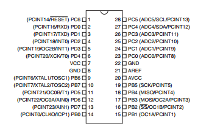
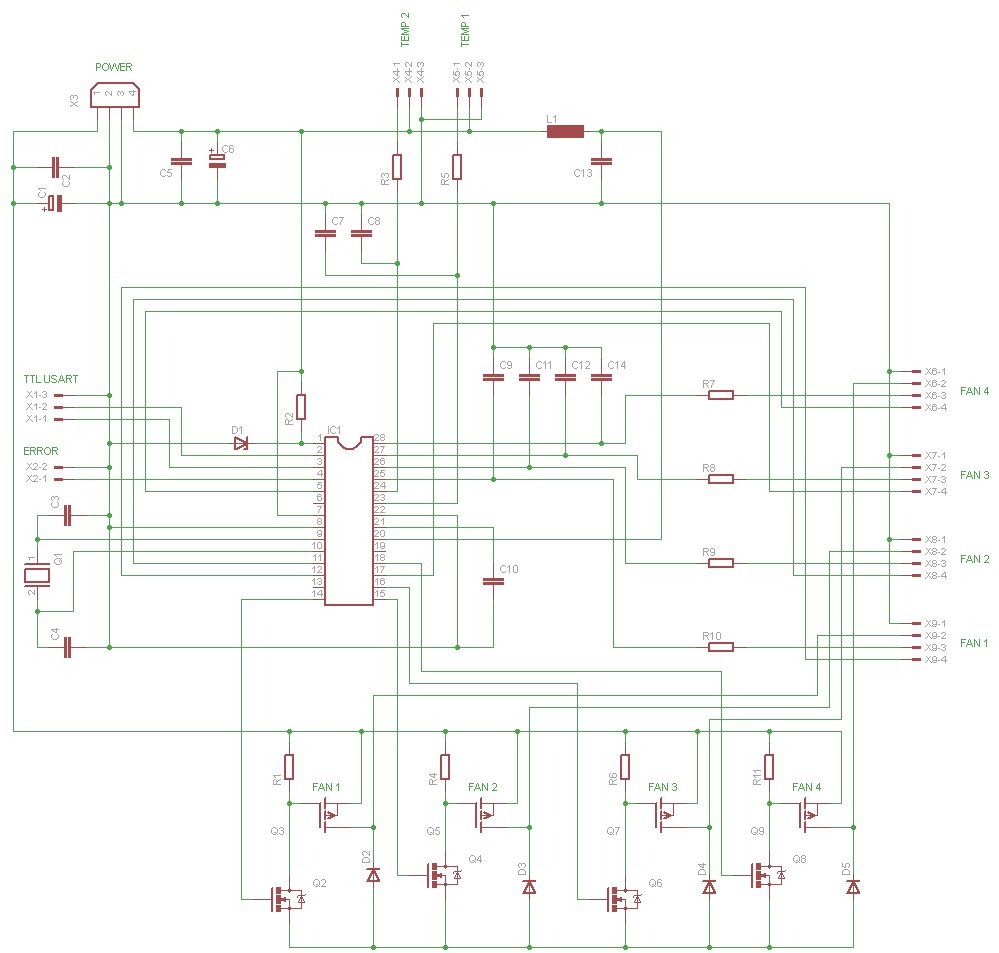
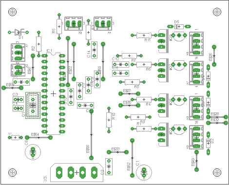

# cooling

PC cooling controller for rotary cooling devices (fans/pumps). It has
the following features:

 * Supports 4 cooling devices.
 * Can disable devices that still run on minimal PWM.
 * Monitors devices RPM.
 * RPM measurement supports pulse stretching.
 * Supports 2 analog sensory devices on ADC.
 * Error signal output.
 * Can be controlled/queried over RS-232 interface.
 * NodeJS library to manipulate the device from PC.
 * Hardware design and source code is MIT-licensed.

The project is still work-in-progress.

## Project structure

The project is divided into 3 subdirectories:

 * `avr` - source for microcontroller binary.
 * `hw` - physical hardware design.
 * `pc` - NodeJS library for communication.

## Hardware

### Pin allocation

 * pin  1: reset, connected to VCC and protected by zener diode
 * pin  2: USART RX line (pullup?)
 * pin  3: USART TX line
 * pin  4: PD2, Error signal output
 * pin  5: PD3, OC2B, fan 4 PWM output
 * pin  6: PD4, not connected
 * pin  7: VCC
 * pin  8: GND
 * pin  9: XTAL 1
 * pin 10: XTAL 2
 * pin 11: PD5, OC0B, fan 2 PWM output
 * pin 12: PD6, OC0A, fan 1 PWM output
 * pin 13: PD7, not connected
 * pin 14: PB0, fan 1 enable
 * pin 15: PB1, fan 2 enable
 * pin 16: PB2, fan 3 enable
 * pin 17: PB3, fan 3 PWM output
 * pin 18: PB4, fan 4 enable
 * pin 19: PB5, not connected
 * pin 20: AVCC, connected to VCC through low-pass filter L1/C13
 * pin 21: AREF, analog reference, decoupled with 100nF cap C10
 * pin 22: GND
 * pin 23: PC0, ADC0, temperature sensor 1 input, low-pass filter R5/C7
 * pin 24: PC1, ADC1, temperature sensor 2 input, low-pass filter R3/C8
 * pin 25: PC2, fan 1 RPM input, pull-up, low-pass filter R10/C9
 * pin 26: PC3, fan 2 RPM input, pull-up, low-pass filter R9/C11
 * pin 27: PC4, fan 3 RPM input, pull-up, low-pass filter R8/C12
 * pin 28: PC5, fan 4 RPM input, pull-up, low-pass filter R7/C14

### Port directions

#### Port B

 * PB0 - output (fan 1 enable)
 * PB1 - output (fan 2 enable)
 * PB2 - output (fan 3 enable)
 * PB3 - output (fan 3 PWM)
 * PB4 - output (fan 4 enable)
 * PB5 - output (not connected)
 * PB6 - output (overriden by xtal)
 * PB7 - output (overriden by xtal)

#### Port C

 * PC0 - input (ADC)
 * PC1 - input (ADC)
 * PC2 - input (fan 1 RPM, pull-up)
 * PC3 - input (fan 2 RPM, pull-up)
 * PC4 - input (fan 3 RPM, pull-up)
 * PC5 - input (fan 4 RPM, pull-up)
 * PC6 - input (default reset config)
 * PC7 - not in circuit/registry

#### Port D

 * PD0 - output (overriden by USART)
 * PD1 - output (overriden by USART)
 * PD2 - output (error)
 * PD3 - output (fan 4 PWM)
 * PD4 - output (not connected)
 * PD5 - output (fan 2 PWM)
 * PD6 - output (fan 1 PWM)
 * PD7 - output (not connected)

### Full schematics

Full schematics in Eagle format can be found in the file `hw/schematics.sch`.

#### Part list

 * C1 10uF/16V
 * C2 100nF/63V 5mm
 * C3, C4 22pF/63V 2.54mm
 * C5 100nF/63V 5mm
 * C6 10uF/16V 5mm
 * C7, C8 10nF/100V 5mm
 * C9, C11, C12, C14 10nF/63V 5mm
 * C10 100nF/63V 5mm
 * C13 100nF/63V 5mm
 * D1 5.1V zener 7.62mm
 * D2, D3, D4, D5 2N4007
 * IC1 Atmega88 DIP28
 * R1, R2, R3, R4, R5, R6, R7, R8, R9, R10, R11 10k
 * Q1 12MHz
 * Q2, Q4, Q6, Q8 2N7000
 * Q3, Q5, Q7, Q9 IRF9530
 * L1 10uH

TODO: molex connectors

### Board layout

Board layout in Eagle format can be found in the file `hw/board.brd`. Layout
suitable for tone-transfer can be found in the PDF file `hw/board.pdf`.

### Building binary

TODO: build dependencies.

To build the HEX binary for the controller:

    cd avr
    make

### Fuses

 * Clock selection: external full swing crystal (CKSEL 0111).
 * Slow raising power: SUT 11.
 * No clock division by 8.
 * Low fuse result: 0xf7.

## Protocol

The communication protocol uses line-based transport format.
Data on individual lines is encoded in hex encoding.

Decoded commands have the following format:

    [command_byte, arguments..., checksum_byte]

Responses have the following format:

    [response_ok, response arguments..., checksum_byte]

or
    [response_fail, checksum_byte]

or
    [response_checksum_fail, checksum_byte]

Multibyte integers are sent in big-endian format.

Maximum decoded message length is 10 bytes.

### Checksum

Checksum computation uses the Pearson hash algorithm:
http://en.wikipedia.org/wiki/Pearson_hashing

### Commands

The following lists valid commands.

#### Query ADC

Commands return unsigned byte value of
current temperature in Celsius.

 * COMMAND_ADC_0 1
 * COMMAND_ADC_1 2

#### Query RPM

Commands return unsigned 2-byte value
of the last RPM measurement result.

 * COMMAND_GET_RPM_0 3
 * COMMAND_GET_RPM_1 4
 * COMMAND_GET_RPM_2 5
 * COMMAND_GET_RPM_3 6

#### Set and query PWM

Commands set and query PWM value
as single unsigned byte value. 0 - min, 255 - max.

 * COMMAND_SET_PWM_0 7
 * COMMAND_SET_PWM_1 8
 * COMMAND_SET_PWM_2 9
 * COMMAND_SET_PWM_3 10
 * COMMAND_GET_PWM_0 11
 * COMMAND_GET_PWM_1 12
 * COMMAND_GET_PWM_2 13
 * COMMAND_GET_PWM_3 14

#### Enable and disable devices

These commands and responses have no arguments.

 * COMMAND_ENABLE_0 15
 * COMMAND_ENABLE_1 16
 * COMMAND_ENABLE_2 17
 * COMMAND_ENABLE_3 18

 * COMMAND_DISABLE_0 19
 * COMMAND_DISABLE_1 20
 * COMMAND_DISABLE_2 21
 * COMMAND_DISABLE_3 22

### Invalid commands

Invalid commands are ignored. Input buffer overflow
on MCU is guarded against by ignoring all non-line-end input
when the buffer is full.

## Changelog

 * 2014-02-01 Physical hardware design is ready.

## Known issues

 * Max ADC input voltage is 1.1V when the internal reference is selected (by default).
 * Temperature sensor MCP9700 needs 100nF decoupling cap at the sensor to ensure
   stable operation.

## License

The MIT License. See the LICENSE file.
